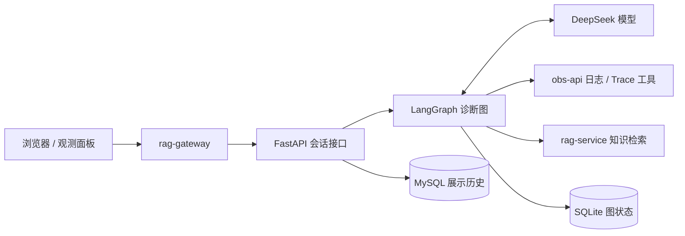

# ops-diagnosis-agent

基于 LangGraph 的运维诊断 Agent。根据用户指定的时间范围和服务，调用日志、Trace 与知识检索工具，逐步收集异常证据并生成诊断回答。使用 FastAPI 提供会话接口，通过 SSE 输出模型文本、工具执行过程和最终状态。

本仓库同时保留手写 Agent 循环与早期 LangGraph 实验，放在 [examples/](examples/README.md)，用于学习和对比实现。正式 HTTP 入口是 `server:app`，诊断图位于 `langgraph_agent_msgstream.py`。

## 在整个项目中的位置

[ops-agent](https://github.com/wang-kang-tuoinai/ops-agent) 将示例业务、观测数据、知识检索和可视化界面连接起来：

| 模块 | 职责 |
| --- | --- |
| `ops-agent-backend` | 用户 CRUD 示例业务，接入 MySQL、Redis、RabbitMQ，产生日志和 Trace |
| `obs-api` | 查询并聚合观测 MySQL 与 Jaeger 数据，提供诊断工具接口和面板快照 |
| **`ops-diagnosis-agent`** | 调用模型与工具，管理诊断执行、上下文、会话历史和流式输出 |
| `rag-service` | 检索项目架构、排查手册及中间件技术文档 |
| `rag-gateway` | 托管聊天与观测面板，代理会话 SSE 和可视化请求 |



典型流程是：用户在面板框选异常窗口并提问 → Agent 查询统计 → 按异常服务、接口或 Trace ID 下钻 → 检索项目行为与排查规范 → 区分已确认事实和待验证原因，给出处置建议。

## 核心设计

- **图驱动的工具循环**：模型返回工具调用时进入 ToolNode，结果作为 ToolMessage 回到模型；没有后续工具调用时结束。同一步的多个工具可并行执行。
- **分层诊断**：日志与 Trace 分别提供统计、搜索/模板和详情，避免首次查询就将大量原始记录塞入上下文。已有 Trace ID 时可直接下钻。
- **知识结果分层使用**：精简后的正文和引用进入模型上下文，完整检索元数据保存在工具 artifact 中供前端展示来源。
- **结构化流式事件**：模型文本、工具开始/结束、失败和完成分别输出，前端按消息及工具调用 ID 组织展示。
- **双存储会话**：MySQL 保存用户可查看的历史；SQLite checkpoint 保存 LangGraph 上下文，支持后续提问。
- **诊断提示词**：[system_prompt.py](system_prompt.py) 约束证据口径、时间范围、工具选择、知识引用和能力边界。每次模型调用注入当前版本，历史中的旧 system 消息不覆盖新规则。

HTTP 与正式 CLI 共用诊断图和提示词。模型适配位于 `deepseek_chat.py`，用于处理当前 DeepSeek 接口的 `reasoning_content` 字段；模型名称与服务地址在 `langgraph_agent_msgstream.py` 的 `MODEL`、`BASE_URL` 中配置。

## 工具

| 工具 | 用途 |
| --- | --- |
| `query_log_stats` | 按服务统计日志级别、ERROR 数与占比；不指定 service 时查看所有匹配服务 |
| `query_log_templates` | 指定服务查看异常模板、次数和样例，检查 has_more 截断提示 |
| `search_logs` | 按服务、Trace ID、路由等条件查原始日志，支持游标分页 |
| `query_trace_stats` | 统计指定服务入口的耗时、状态及下游错误服务摘要 |
| `search_traces` | 按入口 operation、状态、耗时搜索调用摘要 |
| `get_trace_detail` | 查看单次 Trace 的 Span 树、错误及耗时 |
| `search_ops_knowledge` | 检索架构、排查手册和技术资料，返回 `[K-...]` 引用 |
| `get_current_time` | 获取运行进程所在环境的本地时间 |

Trace stats/search 默认查询 `TRACE_ENTRY_SERVICE`，可以传 service 覆盖；分析范围是指定服务的 server 入口及其后代，不包含上游和旁支。日志 ERROR 占比不是请求失败率，代表性错误也不等于已确认根因。Agent 必须保留工具返回的数据缺失、截断和查询失败提示。

## 启动

### Docker Compose（主要运行方式）

在 **ops-agent 根目录**准备 `DEEPSEEK_API_KEY`：可以在已有根 `.env` 中补充，或通过进程环境变量提供。其余服务地址、MySQL 参数和数据卷已由根 `docker-compose.yml` 配置，无需在本仓库复制 `.env.example`。

首次完整部署需先按 `rag-service` 的说明完成知识索引构建，并确认 Compose 的模型缓存挂载路径适合当前机器。随后执行：

```sh
docker compose up -d --build ops-diagnosis-agent rag-gateway
docker compose ps agent-mysql ops-diagnosis-agent rag-gateway
```

命令会按 Compose 依赖关系启动所需服务。Agent 等待会话 MySQL 健康后启动；obs-api 和 rag-service 只要求已启动，因此 RAG 模型仍在加载时知识检索可能暂不可用。

| 地址 / 存储 | 用途 |
| --- | --- |
| `http://localhost:8081` | 网关聊天与观测面板 |
| `http://127.0.0.1:8001/docs` | Agent HTTP 接口文档 |
| `http://127.0.0.1:8001/health` | 应用初始化就绪状态，不逐个检测下游依赖 |
| `agent-mysql:3306/ops_diagnosis` | 容器内会话数据库，宿主机映射为 `127.0.0.1:3308` |
| `agent-mysql-data` | MySQL 会话数据卷 |
| `agent-checkpoints` | `/app/data` 下的 SQLite checkpoint 数据卷 |

修改代码或提示词后，在依赖已运行时更新服务：

```sh
docker compose up -d --build --no-deps ops-diagnosis-agent
```

普通容器重建保留命名数据卷；`docker compose down -v` 会删除卷及会话数据。MySQL 和 SQLite 需要配套保留。已有 MySQL 卷时，仅修改初始化密码环境变量不会同步修改数据库账户密码。

### 本地调试

使用 Python 3.13，与 Docker 镜像一致。在本仓库目录创建环境并安装依赖：

```powershell
python -m venv .venv
.\.venv\Scripts\python.exe -m pip install -r requirements.txt
```

配置进程环境变量，下面示例连接根 Compose 的独立会话 MySQL：

```powershell
$env:DEEPSEEK_API_KEY = "填写自己的密钥"
$env:AGENT_MYSQL_HOST = "127.0.0.1"
$env:AGENT_MYSQL_PORT = "3308"
$env:AGENT_MYSQL_USER = "agent"
$env:AGENT_MYSQL_PASSWORD = "agent"
$env:AGENT_MYSQL_DATABASE = "ops_diagnosis"
$env:OBS_API_BASE = "http://127.0.0.1:8082/api/v1"
$env:RAG_API_BASE = "http://127.0.0.1:8000/api/v1"
.\.venv\Scripts\python.exe -m uvicorn server:app --host 127.0.0.1 --port 8001 --workers 1
```

密码需与实际数据库一致；数据库本身必须存在，服务启动时自动创建会话表。根 Compose 默认不向宿主机发布 rag-service 端口，本地调试需另行运行 RAG 服务或配置实际可访问的地址。不要让本地 Agent 与容器 Agent 同时使用同一套会话表和 checkpoint；也不能只复用会话表而丢弃它所引用的 checkpoint。

只调试诊断图时可运行 `python langgraph_agent_msgstream.py`，不需要会话 MySQL，但仍需模型及工具服务配置。CLI 历史仅保留在当前进程中。

## 配置说明

容器配置以根 Compose 为准；直接运行 Python 不自动加载 `.env`。

| 环境变量 | 本地代码默认值 | 根 Compose 中的配置 |
| --- | --- | --- |
| `DEEPSEEK_API_KEY` | 无，必填 | 从根环境注入 |
| `AGENT_MYSQL_HOST` | `127.0.0.1` | `agent-mysql` |
| `AGENT_MYSQL_PORT` | `3306` | `3306`（容器端口） |
| `AGENT_MYSQL_USER` | `root` | `agent` |
| `AGENT_MYSQL_PASSWORD` | 空 | `${AGENT_MYSQL_PASSWORD:-agent}` |
| `AGENT_MYSQL_DATABASE` | `ops_agent` | `ops_diagnosis` |
| `AGENT_CHECKPOINT_PATH` | 仓库内 `data/checkpoints.sqlite` | `/app/data/checkpoints.sqlite` |
| `AGENT_KEEP_TURNS` | `20` | 默认 `20`，至少 1 |
| `OBS_API_BASE` | `http://localhost:8082/api/v1` | `http://obs-api:8081/api/v1` |
| `TRACE_ENTRY_SERVICE` | `ops-agent-backend` | 默认 `ops-agent-backend` |
| `RAG_API_BASE` | `http://localhost:8000/api/v1` | `http://rag-service:8000/api/v1` |

`AGENT_KEEP_TURNS` 控制 HTTP 服务每次模型调用保留的最近用户轮次，包含当前问题。正式 CLI 使用代码中的 `KEEP_TURNS`（当前为 100）。裁剪保留完整工具调用/返回配对，只影响模型输入，不删除历史或缩减已经持久化的图状态。

## 会话与接口

服务端创建 `conversation_id`（UUID），客户端后续携带该 ID 与本轮问题。每轮生成独立的 `run_id`；同一会话最多同时运行一轮，不同会话可以并发。

| 方法 | 路径 | 用途 |
| --- | --- | --- |
| POST | `/api/v1/conversations` | 创建会话 |
| GET | `/api/v1/conversations` | 会话列表，limit/offset 分页 |
| POST | `/api/v1/conversations/{conversation_id}/messages` | 提问并接收 SSE |
| GET | `/api/v1/conversations/{conversation_id}/messages` | 最近历史，before 游标向前翻页 |
| GET | `/api/v1/conversations/{conversation_id}/runs/{run_id}` | 查看单轮状态与已有输出 |
| POST | `/api/v1/conversations/{conversation_id}/runs/{run_id}/cancel` | 取消本轮执行 |

提问示例：

```json
{
  "question": "分析 1789479485 到 1789479545 期间 ops-agent-backend 的异常，区分失败请求与降级请求。",
  "request_id": "2a6ae512-6316-430d-bd30-dd907998ad19"
}
```

`request_id` 可选；前端重试同一次提交时应复用它，新问题使用新值，避免重复生成。重复提交返回 409 和原 run_id。

SSE 事件包括 `meta`、`thinking`（模型提供时）、`content`、`tool_start`、`tool_end`、`error`、`done`。前端通过 POST + fetch 读取流，用 message_id 拼接文本、tool_call_id 配对工具事件；单个网络块不一定是一条完整事件。

MySQL 保存展示历史和最后成功的 checkpoint 指针；SQLite `AsyncSqliteSaver` 保存图上下文。失败/取消的部分输出可查看，但下一轮从最后成功的 checkpoint 继续。断流后应查询 run 状态，当前不支持自动续跑或 SSE 断点续传。

完整响应、历史分页、取消与持久化语义见 [HTTP / SSE 协议](docs/http-api.md)。

## 目录

```text
server.py                       FastAPI 生命周期、路由、SSE 响应
backend_models.py               请求、历史与事件模型
diagnosis_runtime.py            执行管理、取消、事件持久化与 checkpoint 衔接
conversation_store.py           MySQL 会话存储、事务与启动恢复
langgraph_agent_msgstream.py     正式诊断图与 CLI
deepseek_chat.py                 模型消息与流式字段适配
system_prompt.py                正式诊断提示词
langgraph_tools.py              工具描述、HTTP 适配与工具注册
rag_tools.py                    知识检索、内容投影与来源引用
common_tools.py                 正式服务和示例共用的基础工具函数
graph_events.py                 工具执行开始/结束事件
examples/                       手写循环与早期 LangGraph 学习示例
tests/                          单元、接口及可选 MySQL 集成测试
docs/                           HTTP 协议、设计说明与学习笔记
```

`examples/`、`tests/` 和 `docs/` 不进入服务镜像。正式服务不导入学习示例；所有工具名称、注册顺序和 HTTP 入口保持一致。

## 测试

在本仓库根目录、已安装依赖的 Python 环境中执行：

```powershell
.\.venv\Scripts\python.exe -m unittest discover -s tests -t . -v
```

普通测试使用模拟模型/HTTP、内存历史存储及临时 SQLite，不需要模型密钥或真实 MySQL。真实 MySQL 测试仅在 `AGENT_TEST_MYSQL=1` 时启用，默认跳过。覆盖会话、SSE、取消、上下文恢复、提示词注入、日志/Trace 参数及 RAG 引用投影。

测试分组、单独执行命令和 MySQL 集成测试配置见 [tests/README.md](tests/README.md)。这些测试验证程序行为，不代表真实模型诊断准确率；故障场景还需结合实际工具证据人工验收。

## 当前边界

- 会话执行与启动恢复要求单进程、单实例（`--workers 1`），尚未实现多实例任务租约。
- 接口面向本地演示，尚无用户认证、会话归属隔离、会话删除及标题修改。
- SQLite 和 MySQL 不构成跨数据库事务；恢复以 MySQL 已提交的 checkpoint 指针为准，启动时将残留 running 记录标为 interrupted。
- 模型或网络异常可能中断生成；同步 HTTP 工具取消后仍可能等待自身超时，不能保证下游请求立即终止。
- 当前诊断工具只读，不会自动重启组件、修改配置或修复数据。模型结论仍需依据实际证据验证。

## 进一步阅读

- [诊断提示词与回归方法](docs/prompt-design.md)
- [知识工具与引用设计](docs/rag-tool.md)
- [LangChain / LangGraph 架构学习笔记](docs/architecture.md)
- [LangGraph 与手写循环对比](docs/langgraph-vs-handwritten.md)
- [学习示例运行方法](examples/README.md)
